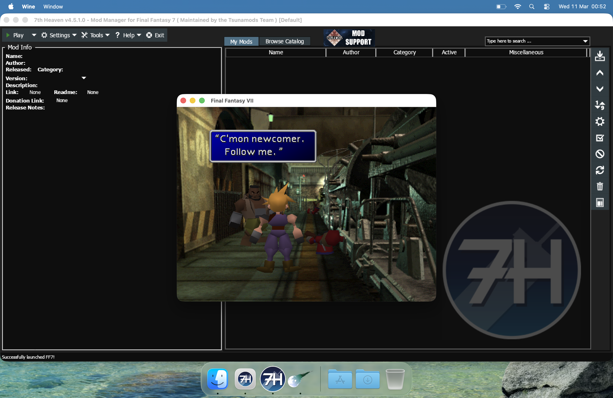
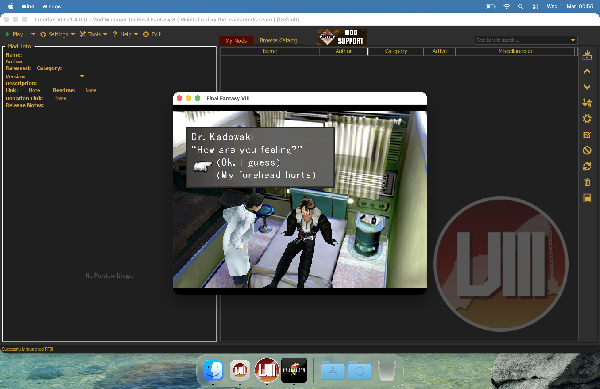

# SummonKit

macOS wrappers for Final Fantasy Mod managers

## How to use

Depending on which game edition you own you might want to follow one of the following sections.

**PLEASE NOTE:** This app has NOT been notarized, so you will need to manually allow the app to run. [See How to open an app that hasn’t been notarized or is from an unidentified developer](https://support.apple.com/en-us/102445)

## 7th Heaven



> **PLEASE NOTE:**
>
> **Vulkan is the suggested backend renderer**, which seems to provide the best performance under Apple Silicon.
>
> DirectX 11/12 works, but experience may vary, feel free to test.
>
> OpenGL under Apple Silicon simply does NOT work.<br>
> On Intel Macs it may, depending on which GPU you have. Do not consider using this option as it is provided for legacy reasons.

- Download the [latest release](https://github.com/julianxhokaxhiu/SummonKit/releases/latest) and install the `7thHeaven.app` in your `Applications` folder

### GOG Release

- Download the installer files from the [GOG release](https://www.gog.com/en/game/final_fantasy_vii)
- Launch `7thHeaven.app` and follow the prompts ( accept permission requests if any )
- When asked to pick an installer pick the `setup_final_fantasy_vii_2.0_gog_v1_(88522).exe` file
- Accept the EULA and click on Install
- Click on Exit when the installer finishes
- When 7th Heaven launches, hit Save on the Settings window and wait for FFNx to be installed
- Hit Play and Enjoy!

### Steam 2013 or Rerelease

> **PLEASE NOTE:**
>
> Steam achievements are currently NOT supported. It requires a native IPC layer which is available only under Windows and Linux/Proton.

- Install [Steam for Mac](https://cdn.fastly.steamstatic.com/client/installer/steam.dmg)
- Quit the Steam app
- Run this in your terminal: `echo "@sSteamCmdForcePlatformType windows" > ~/Library/Application Support/Steam/Steam.AppBundle/Steam/Contents/MacOS/steam_dev.cfg`
- Open Steam and install [FINAL FANTASY VII (2013)](https://steamdb.info/app/39140/) or [FINAL FANTASY VII](https://steamdb.info/app/3837340/)
- Launch `7thHeaven.app` and follow the prompts ( accept permission requests if any )
- When asked to pick an installed click on Skip
- When 7th Heaven launches, hit `Save` on the Settings window and wait for FFNx to be installed
- **SUGGESTED:** Go to `Settings -> Game Driver -> Backend` and choose `Vulkan` then hit `Save`
- Hit Play and Enjoy!

## Junction VIII



> **PLEASE NOTE:**
>
> **Vulkan is the suggested backend renderer**, which seems to provide the best performance under Apple Silicon.
>
> DirectX 11/12 works, but experience may vary, feel free to test.
>
> OpenGL under Apple Silicon simply does NOT work.<br>
> On Intel Macs it may, depending on which GPU you have. Do not consider using this option as it is provided for legacy reasons.

- Download the [latest release](https://github.com/julianxhokaxhiu/SummonKit/releases/latest) and install the `JunctionVIII.app` in your `Applications` folder

### Steam 2013

> **PLEASE NOTE:**
>
> Steam achievements are currently NOT supported. It requires a native IPC layer which is available only under Windows and Linux/Proton.

- Install [Steam for Mac](https://cdn.fastly.steamstatic.com/client/installer/steam.dmg)
- Quit the Steam app
- Run this in your terminal: `echo "@sSteamCmdForcePlatformType windows" > ~/Library/Application Support/Steam/Steam.AppBundle/Steam/Contents/MacOS/steam_dev.cfg`
- Open Steam and install [FINAL FANTASY VIII](https://steamdb.info/app/39150/)
- Launch `JunctionVIII.app` and follow the prompts ( accept permission requests if any )
- When Junction VIII launches, hit `Save` on the Settings window and wait for FFNx to be installed
- **SUGGESTED:** Go to `Settings -> Game Driver -> Backend` and choose `Vulkan` then hit `Save`
- Hit Play and Enjoy!

## How to build

### Preparation

Make sure you have installed the [XCode Command Line Tools](https://developer.apple.com/documentation/xcode/installing-the-command-line-tools#Install-the-Command-Line-Tools-package-in-Terminal)

The final result will be in the `dist/` folder.

### 7th Heaven

```sh
$ git clone https://github.com/julianxhokaxhiu/SummonKit.git
$ cd SummonKit
$ ./7thHeaven/build_app.sh
```

### Junction VIII

```sh
$ git clone https://github.com/julianxhokaxhiu/SummonKit.git
$ cd SummonKit
$ ./JunctionVIII/build_app.sh
```

## Credits

This wrapper is possible thanks to:

- [Dean M Greer](https://github.com/Gcenx) for [Winehq macOS Builds](https://github.com/Gcenx/macOS_Wine_builds)
- [Feifan He](https://github.com/3Shain) for [DXMT](https://github.com/3Shain/dxmt)

## License

SummonKit is released under GPLv3 license. You can get a copy of the license here: [COPYING.TXT](COPYING.TXT)

If you paid for SummonKit, remember to ask for a refund from the person who sold you a copy. Also make sure you get a copy of the source code (if it was provided as binary only).

If the person who gave you this copy refuses to give you the source code, report it here: https://www.gnu.org/licenses/gpl-violation.html

All rights belong to their respective owners.
